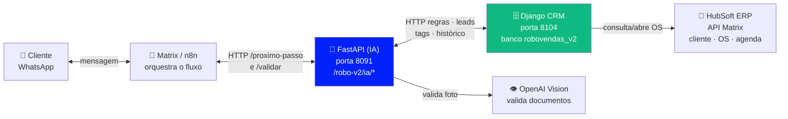
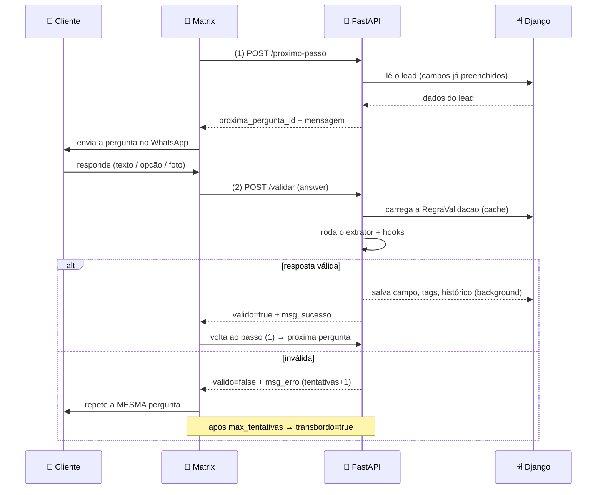
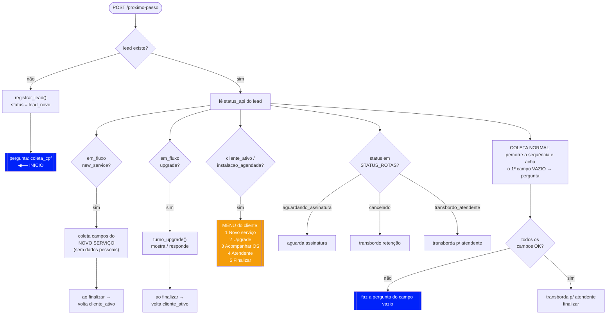
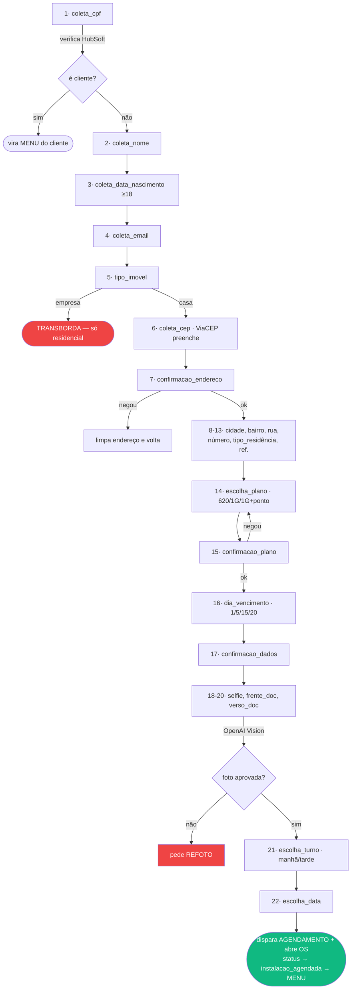
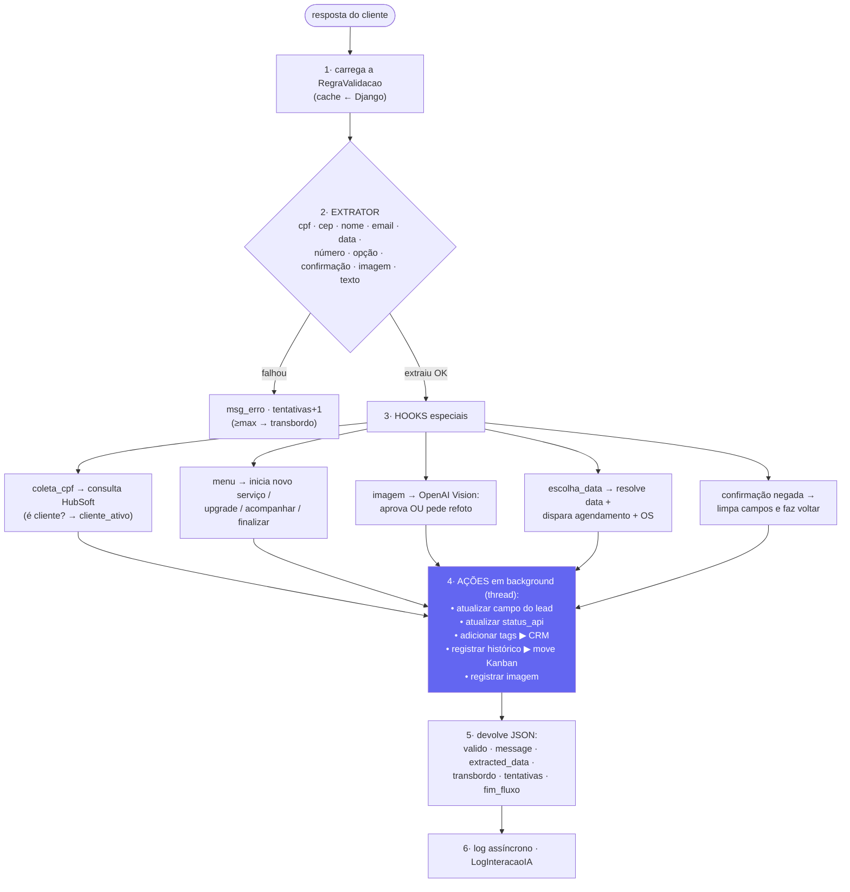
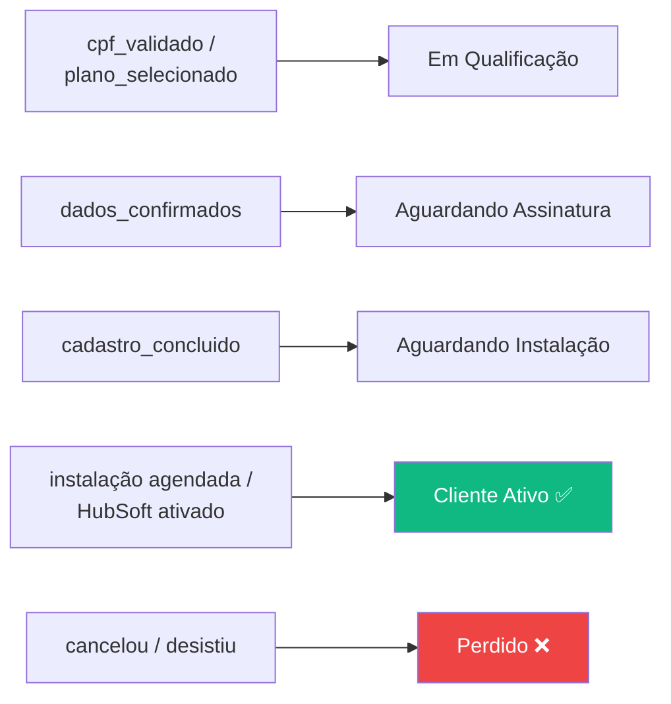

# Fluxograma — Atendimento Determinístico (Robô de Vendas V2)

> Documentação do fluxo determinístico do robô de vendas conduzido pela API.
> Os diagramas estão em [Mermaid](https://mermaid.live) — renderizam direto no
> GitHub/GitLab/VS Code (extensão *Markdown Preview Mermaid*).
>
> Endpoints públicos (TecHub):
> `POST https://techub.megalinkpiaui.com.br/robo-v2/ia/proximo-passo`
> `POST https://techub.megalinkpiaui.com.br/robo-v2/ia/validar`

---

## 1. As 4 camadas e como se comunicam

> Versão em imagem (caso o Mermaid não renderize): [`img/01-visao-geral.png`](img/01-visao-geral.png)



**Papel de cada camada:**

| Camada | Papel | Guarda estado? |
|---|---|---|
| **Matrix / n8n** | O maestro: mostra a pergunta, recebe a resposta e chama a API. Não tem lógica de fluxo. | Não |
| **FastAPI (IA)** | O cérebro: decide a próxima pergunta e valida cada resposta. Sem banco. | Não |
| **Django CRM** | A memória: lead, regras, histórico, tags, pipeline. | **Sim** |

> A "memória" do fluxo é o **próprio preenchimento do lead** no Django — não há
> máquina de estados à parte. O robô sabe onde parou olhando quais campos do
> cadastro ainda estão vazios.

---

## 2. O loop de 2 chamadas (o coração do fluxo)

Para **cada pergunta**, o Matrix faz sempre o mesmo par de chamadas:



---

## 3. A árvore de decisão do `/proximo-passo`

> Versão em imagem: [`img/03-arvore-decisao.png`](img/03-arvore-decisao.png)



---

## 4. Sequência canônica de coleta (cliente novo)

O `/proximo-passo` pergunta o **primeiro campo vazio** desta lista:



---

## 5. O que acontece dentro do `/validar`



---

## 6. Conexão com o CRM (pipeline automático)

Cada etapa validada grava um `historico_status` no Django; as **regras de
pipeline** usam esse status para mover o card no Kanban automaticamente.



---

## 7. /validar vs /proximo-passo

| | **/proximo-passo** | **/validar** |
|---|---|---|
| Pergunta que responde | "Qual pergunta eu faço agora?" | "Essa resposta serve?" |
| Quando o Matrix chama | Antes de mostrar a pergunta | Depois que o cliente responde |
| Lê | status + campos do lead | a RegraValidacao da pergunta |
| Efeito colateral | cria lead se não existe | salva dado, tags, histórico, status |
| Decide transbordo? | sim (fim do fluxo / status) | sim (após max_tentativas) |

**Corpo das requisições:**

```jsonc
// POST /robo-v2/ia/proximo-passo
{ "cellphone": "5586999990000", "lead_id": 123, "ultima_mensagem": "" }

// POST /robo-v2/ia/validar
{ "question_id": "coleta_cpf", "question": "Qual seu CPF?",
  "answer": "111.444.777-35", "cellphone": "5586999990000", "lead_id": 123 }
```

---

## 8. Principais endpoints Django consumidos pela FastAPI

| Endpoint Django | Quando |
|---|---|
| `GET /ia_validador/api/regras-validacao/` | Carrega as regras (cache 1h) |
| `GET /api/consultar/leads/` | Busca lead por telefone |
| `POST /api/leads/registrar/` | Cria lead novo |
| `POST /api/leads/atualizar/` | Salva campo do lead |
| `POST /api/leads/tags/` | Adiciona/remove tags (alimenta o CRM) |
| `POST /api/historicos/registrar/` | Grava histórico (move o pipeline) |
| `POST /api/leads/imagens/registrar/` | Registra documento validado |
| `POST /integracoes/api/lead/hubsoft-check/` | Verifica se o CPF é cliente |
| `POST /api/leads/agendar-ia/` | Dispara agendamento + abre OS |
| `POST /api/new-service/*` · `/api/upgrade-conversa/turno/` | Fluxos pós-venda |

---

## Resumo em uma frase

O Matrix pergunta **"o que faço agora?"** (`/proximo-passo`) e **"essa resposta
serve?"** (`/validar`); a FastAPI decide olhando os campos já preenchidos do lead
no Django, valida com extratores (e OpenAI Vision para fotos) e grava tudo de
volta — alimentando automaticamente o status, as tags e o pipeline do CRM.

---

### Arquivos de referência (código)

| Arquivo | Função |
|---|---|
| `ia_validacao/src/app.py` | endpoints `/validar` e `/proximo-passo` |
| `ia_validacao/src/onboarding.py` | `decidir_proximo_passo`, `SEQUENCIA_COLETA`, `STATUS_ROTAS` |
| `ia_validacao/src/regras/engine.py` | `validar_por_regra`, extratores, ações |
| `ia_validacao/src/acoes.py` | execução das ações no Django |
| `ia_validacao/src/integracoes/robovendas.py` | cliente HTTP do Django |
