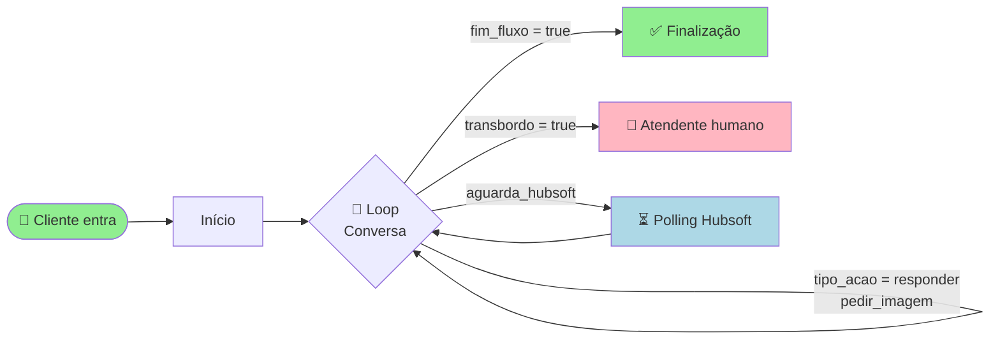
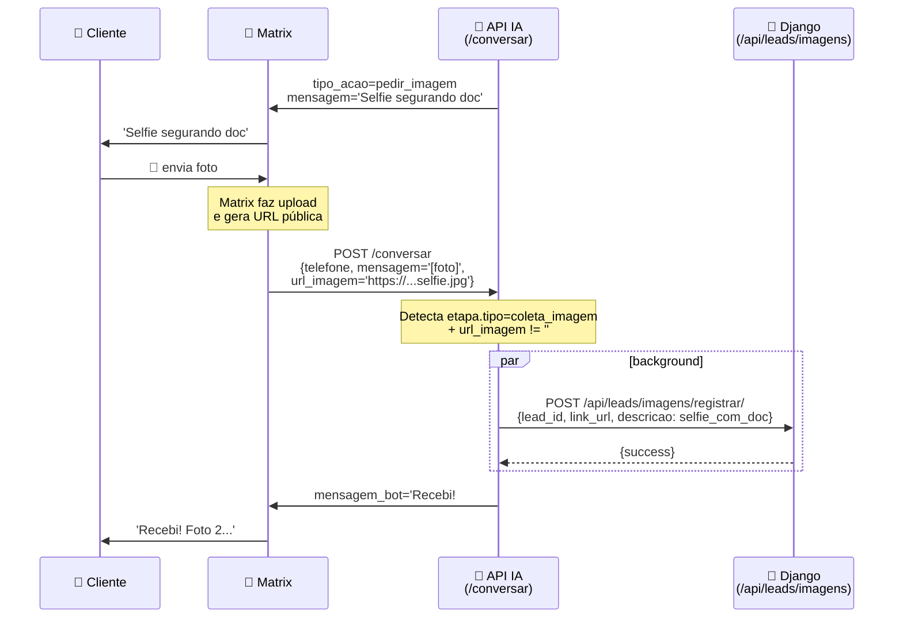
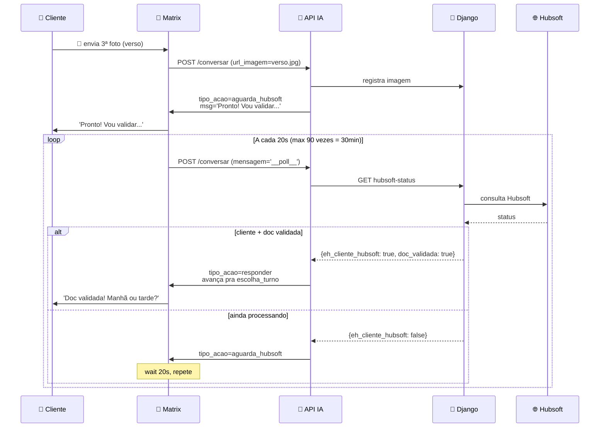
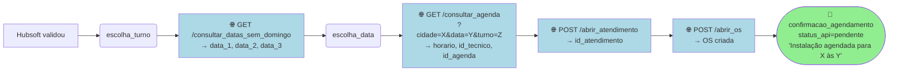

# 🌊 Fluxograma do Fluxo Dinâmico — Aurora

Documento de referência visual para montar o fluxo no editor do Matrix.

A ideia central: **o Matrix é "burro"** — só recebe mensagem, joga pra API IA, e exibe a resposta. Toda a lógica de etapas, validações, chamadas pro Django e integrações com Hubsoft fica na API.

---

## 1️⃣ Visão geral (alto nível)



O fluxo Matrix nunca decide *qual* etapa está sendo executada — quem decide é a API. O Matrix só lê `tipo_acao` e segue a branch correta.

---

## 2️⃣ Fluxo Matrix em detalhe (o que você desenha no editor)

```mermaid
flowchart TD
    Start([▶️ start]) --> SetVar[/"📝 set var<br/>url_ia = .../ia/conversar<br/>imagem_url = ''"/]
    SetVar --> Welcome[💬 msg_boas_vindas<br/>'Oi! Sou a Aurora...']
    Welcome --> Loop

    Loop[/"⏸ sol_loop<br/>aguarda mensagem<br/>(texto OU imagem)"/]
    Loop -->|Validado| ApiConv
    Loop -->|⚠️ Inválido| RedTrans1[red → transbordo]
    Loop -->|⏰ Timeout| RedFim1[red → finalização]

    ApiConv["🌐 api_conversar<br/>POST /ia/conversar<br/>{telefone, mensagem, url_imagem}<br/>← {mensagem_bot, tipo_acao,<br/>fim_fluxo, transbordo}"]
    ApiConv --> Dec{🔀 dec_destino}

    Dec -->|fim_fluxo = true| RedFim2[red → finalização]
    Dec -->|transbordo = true| RedTrans2[red → transbordo]
    Dec -->|aguarda_hubsoft| MsgWait[💬 msg 'aguardando...']
    Dec -->|Padrão| MsgBot[💬 msg_bot<br/>'{mensagem_bot}']

    MsgWait --> Wait20[/"⏱ wait 20s"/]
    Wait20 --> ApiConv

    MsgBot --> ZeraImg[/"📝 set imagem_url = ''"/]
    ZeraImg --> Loop

    RedFim1 --> FinGrp
    RedFim2 --> FinGrp
    RedTrans1 --> SerGrp
    RedTrans2 --> SerGrp

    FinGrp[💬 msg_fim → 🏁 fin]
    SerGrp[💬 msg_transbordo → 👤 ser]

    style Start fill:#90EE90
    style ApiConv fill:#ADD8E6,color:#000
    style Dec fill:#FFD700,color:#000
    style FinGrp fill:#90EE90
    style SerGrp fill:#FFB6C1
    style Wait20 fill:#E0E0FF
```

**Total: ~26 nós + 14 edges** (vs 538 do flow original).

---

## 3️⃣ O que a API IA faz por dentro (cada chamada `/conversar`)

```mermaid
flowchart TD
    In([📨 POST /conversar<br/>{telefone, mensagem, url_imagem}]) --> Ctx[Lê contexto<br/>etapa_atual do telefone]
    Ctx --> First{Primeira<br/>interação?}
    First -->|Sim| StartE[etapa = primeira do YAML<br/>= 'cumprimento']
    First -->|Não| EtapaDef[Carrega etapa do YAML]
    StartE --> EtapaDef

    EtapaDef --> TipoEt{Tipo da<br/>etapa?}

    TipoEt -->|coleta_imagem<br/>+ url_imagem| RegImg
    TipoEt -->|aguarda_hubsoft| PollHub
    TipoEt -->|pergunta<br/>confirmacao<br/>escolha_*| Val

    RegImg["💾 registrar_imagem<br/>POST /api/leads/imagens/<br/>registrar/<br/>{lead_id, link_url, descricao}"] --> Avanca1[Avança etapa<br/>= próxima do YAML]
    Avanca1 --> Out

    PollHub["🌐 hubsoft_status<br/>GET /integracoes/api/lead/<br/>hubsoft-status/?lead_id=X"] --> ChkHub{cliente +<br/>doc validada?}
    ChkHub -->|Sim| Avanca2[Avança etapa<br/>= escolha_turno]
    ChkHub -->|Não| Mantem[Mantém etapa<br/>tipo_acao = aguarda_hubsoft]
    Avanca2 --> Out
    Mantem --> Out

    Val[Validação] --> Local{Extractor<br/>local resolve?<br/>cpf, cep, nome,<br/>telefone, data}
    Local -->|Sim, válido| ValOk
    Local -->|Não / inconclusivo| IA[🤖 OpenAI gpt-4o-mini<br/>system: persona Aurora<br/>user: contexto + resposta<br/>force JSON]
    IA -->|valido=true| ValOk
    IA -->|valido=false| Invalid

    ValOk[✅ válido<br/>extrai dados] --> ExecAcoes[Executa acoes_pos_etapa<br/>em background]
    ExecAcoes --> Avanca3[Avança etapa]
    Avanca3 --> Sync

    Invalid[❌ inválido<br/>incrementa tentativa] --> Repete{tentativas<br/>>= max?}
    Repete -->|Sim| Transb[etapa = transbordo_humano]
    Repete -->|Não| Mesmo[Mantém mesma etapa<br/>com mensagem de erro]
    Transb --> Out
    Mesmo --> Out

    Sync["🔄 sincronizar_dados<br/>POST /api/leads/atualizar/<br/>{termo_busca, busca, campos}"] --> Out

    Out([📤 retorna<br/>{mensagem_bot, tipo_acao,<br/>proxima_etapa, fim_fluxo,<br/>transbordo_humano}])

    style In fill:#90EE90
    style Out fill:#90EE90
    style RegImg fill:#ADD8E6
    style PollHub fill:#ADD8E6
    style Sync fill:#ADD8E6
    style IA fill:#FFE4B5
    style ExecAcoes fill:#DDA0DD
```

---

## 4️⃣ Sequência de etapas do YAML (`vendas_megalink.yaml`)

```mermaid
flowchart TD
    A1([cumprimento]) -->|registrar_historico:<br/>fluxo_inicializado| A2(tipo_imovel)
    A2 --> A3(coleta_cep)
    A3 -->|tag: 'Endereço'| A4(coleta_numero)
    A4 --> A5(coleta_ponto_referencia)
    A5 --> A6(coleta_nome)
    A6 -->|tag: 'Comercial'| A7(coleta_cpf)
    A7 --> A8(coleta_rg)
    A8 --> A9(coleta_data_nascimento)
    A9 --> A10(coleta_email)
    A10 --> A11(escolha_plano)
    A11 --> A12(dia_vencimento)
    A12 --> A13(confirmacao_dados)

    A13 -->|status_api:<br/>aguardando_assinatura<br/>tag: 'Assinado'| B1

    subgraph DOCS [📸 Documentação]
        B1(documentacao_selfie<br/>tipo: coleta_imagem<br/>descricao: selfie_com_doc)
        B2(documentacao_frente_doc<br/>tipo: coleta_imagem<br/>descricao: frente_doc)
        B3(documentacao_verso_doc<br/>tipo: coleta_imagem<br/>descricao: verso_doc)
        B1 --> B2 --> B3
    end

    B3 --> C1(aguarda_documentacao<br/>tipo: aguarda_hubsoft<br/>polling 20s, max 90×)

    C1 -->|hubsoft validou| D1(escolha_turno<br/>manhã / tarde)
    D1 --> D2(escolha_data<br/>3 datas)
    D2 --> D3(confirmacao_agendamento<br/>status_api: pendente<br/>registrar_historico:<br/>fluxo_finalizado)

    D3 --> E1([encerramento<br/>fim])

    style A13 fill:#FFD700
    style C1 fill:#ADD8E6
    style E1 fill:#90EE90
    style B1 fill:#FFE4B5
    style B2 fill:#FFE4B5
    style B3 fill:#FFE4B5
```



---

## 5️⃣ Tabela de APIs — quem chama, quando e por quê

### APIs internas (do projeto Django Robo Vendas — `robovendas.megalinkpiaui.com.br`)

| API | Método | Quando é chamada | Quem chama | Payload | Retorno |
|-----|--------|------------------|------------|---------|---------|
| `/api/consultar/leads/?search=TEL` | GET | 1ª interação no fluxo | API IA | — | `{results: [{id}]}` |
| `/api/leads/registrar/` | POST | 1ª interação se lead não existe | API IA | `{nome_razaosocial, telefone, origem, status_api: processamento_manual, id_vendedor_rp, ...}` | `{id}` |
| `/api/leads/atualizar/` | POST | Após cada etapa com dados extraídos | API IA (background) | `{termo_busca: id, busca: lead_id, <campos>}` | `{success: true}` |
| `/api/leads/tags/` | POST | Após `coleta_cep`, `coleta_nome`, `confirmacao_dados` | API IA (acao adicionar_tags) | `{lead_id, tags_add: [...], tags_remove: []}` | `{success: true}` |
| `/api/leads/imagens/registrar/` | POST | Cada coleta_imagem (selfie, frente, verso) | API IA (acao registrar_imagem) | `{lead_id, link_url, descricao}` | `{success: true}` |
| `/api/historicos/registrar/` | POST | Início do fluxo, transbordo, finalização | API IA (acao registrar_historico) | `{telefone, lead_id, status, observacoes}` | `{success: true}` |
| `/integracoes/api/lead/hubsoft-status/?lead_id=X` | GET | Polling após documentação enviada | API IA (etapa aguarda_hubsoft) | — | `{eh_cliente_hubsoft, lead: {documentacao_validada}, servicos: [{id_cliente_servico}]}` |

### APIs externas (apimatrix da Matrix do Brasil — `apimatrix.megalinkpiaui.com.br`)

| API | Método | Quando | Payload | Retorno |
|-----|--------|--------|---------|---------|
| `/consultar_datas_sem_domingo?data_referencia=DDMMAA` | GET | Antes de `escolha_data` | — | `{datas: [data1, data2, data3]}` |
| `/consultar_agenda?cidade=X&data_referencia=Y&turno=Z&qtd_vagas=1` | GET | Após cliente escolher data + turno | — | `{dados: {disponibilidade_turno: [{horario, tecnicos: [{id}]}], id_agenda_ordem_servico}}` |
| `/abrir_atendimento` | POST | Após confirmar agendamento | `{id_cliente_servico, nome, telefone, descricao, id_tipo_atendimento: 535, ...}` | `{atendimento: {id_atendimento}}` |
| `/abrir_os` | POST | Junto com abrir_atendimento | `{id_atendimento, id_tipo_ordem_servico: 702, id_agenda_ordem_servico, data, hora, duracao: 01:30:00, id_tecnico, empresa: megalink}` | `{success: true}` |

### APIs externas (terceiros)

| API | Método | Quando | Por quê |
|-----|--------|--------|---------|
| OpenAI `/v1/chat/completions` | POST | Quando extractor local falha | Validação semântica + extração de dados |
| ViaCEP `/{cep}/json/` | GET | Etapa `coleta_cep` (dentro do extractor) | Buscar logradouro/bairro/cidade do CEP |

---

## 6️⃣ Fluxo de imagens — Como o Matrix entrega URL pra API



**Detalhe importante:** no flow.json do Matrix, o nó `set var imagem_url` deve copiar a URL retornada do upload da imagem PRA `{#imagem_url}`. Esse valor é passado pro `/conversar` no próximo envio. Depois que a API responde, o `set var_zera_imagem` limpa `{#imagem_url}` pra que a próxima mensagem de TEXTO não seja interpretada como imagem.

---

## 7️⃣ Polling Hubsoft (após enviar documentação)



---

## 8️⃣ Agendamento final (depois do Hubsoft validar)



---

## 9️⃣ Lista de etapas com `acoes_pos_etapa`

| Etapa | Ações disparadas ao concluir |
|-------|------------------------------|
| `cumprimento` | `registrar_historico: fluxo_inicializado` |
| `coleta_cep` | `adicionar_tags: [Endereço]` |
| `coleta_nome` | `adicionar_tags: [Comercial]` |
| `confirmacao_dados` | `atualizar_status: aguardando_assinatura` + `adicionar_tags: [Assinado]` |
| `documentacao_selfie` | `registrar_imagem: selfie_com_doc` (auto, no /conversar) |
| `documentacao_frente_doc` | `registrar_imagem: frente_doc` |
| `documentacao_verso_doc` | `registrar_imagem: verso_doc` |
| `confirmacao_agendamento` | `atualizar_status: pendente` + `registrar_historico: fluxo_finalizado` |
| `transbordo_humano` | `registrar_historico: transferido_humano` |

---

## 🔟 Componentes do flow.json (referência Matrix)

| `cod_componente` | Tipo | Quando usar |
|------------------|------|-------------|
| 1 | msg | Mensagem do bot pro cliente |
| 2 | sol | Aguarda resposta do cliente |
| 4 | fin | Encerra atendimento |
| 7 | ser | Transbordo pra fila de atendentes |
| 8 | dec | Decisão (condicional) |
| 9 | api | Chamada HTTP |
| 10 | ura | Menu com botões (não usamos no dinâmico) |
| 13 | var | Define/seta variáveis |
| 15 | start | Início do fluxo |
| 17 | red | Redirect pra outro nó |
| 18 | group | Agrupador visual |
| 26 | wait | Espera N segundos |

---

## 🎨 Legenda de cores (Mermaid)

| Cor | Significado |
|-----|-------------|
| 🟢 Verde | Início ou fim feliz |
| 🟠 Laranja | Aguardando input |
| 🔵 Azul | Chamada HTTP / API |
| 🟡 Amarelo | Decisão |
| 🌸 Rosa | Transbordo / erro |
| 🟣 Roxo | Ação em background (acoes_pos_etapa) |

---

## 📌 Resumo do que desenhar no Matrix

1. **Grupo INICIO** — start → set var (url_ia, imagem_url) → msg boas-vindas → redirect pro loop
2. **Grupo CONVERSA** (o coração):
   - **sol_loop** com 3 saídas: Validado, Inválido, Tempo de espera
   - **api_conversar** com store capturando `mensagem_bot`, `tipo_acao`, `fim_fluxo`, `transbordo_humano`
   - **dec_destino** com 4 condições:
     - `fim_fluxo == "true"` → red FIM
     - `transbordo_humano == "true"` → red TRANSBORDO
     - `tipo_acao == "aguarda_hubsoft"` → wait 20s → volta pra api_conversar
     - **Padrão** → msg_bot → set imagem_url='' → red sol_loop
3. **Grupo FINALIZACAO** — msg_fim → fin
4. **Grupo TRANSBORDO** — msg_transbordo → ser

Todo o resto (etapas, validações, chamadas Hubsoft, agendamento) acontece **dentro da API IA**, transparentemente.
