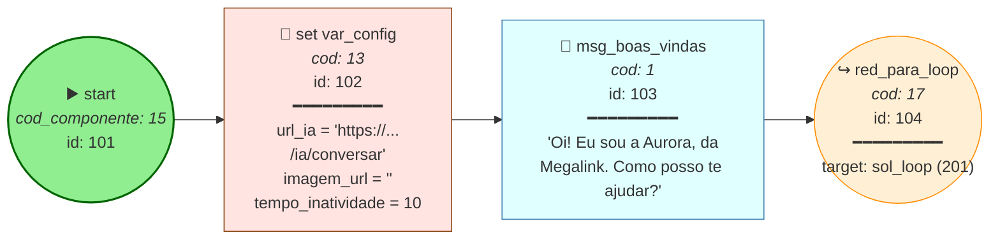
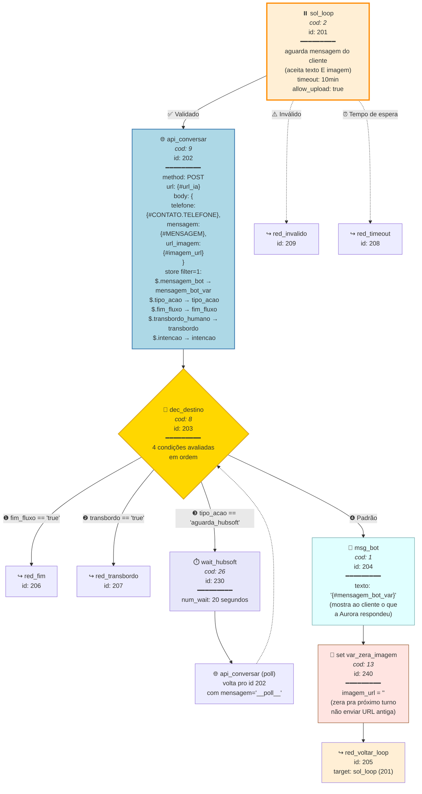
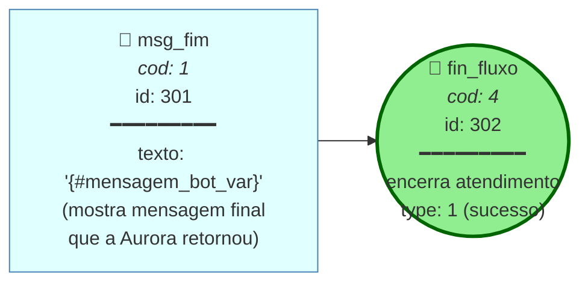
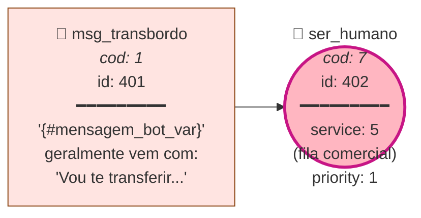
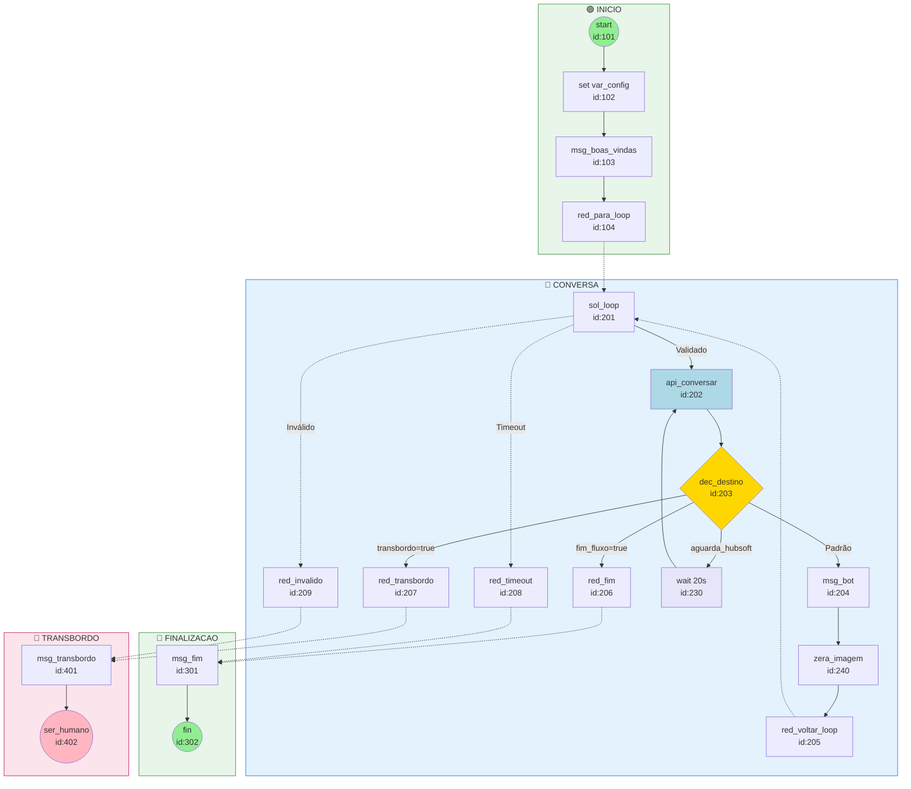

# 🧩 Fluxograma Matrix — Construção Visual Completa

Documento de referência para montar o fluxo **nó por nó** no editor visual do Matrix.

> Cada bloco abaixo representa um componente que deve ser arrastado no editor.
> As **conexões** estão nomeadas (Validado / Inválido / Tempo de espera / condições do dec).

---

## 🗺️ Layout geral do canvas

```
┌─────────────────────────────────────────────────────────────────┐
│  GRUPO 1: INÍCIO                                                │
│  (entry point — config + boas vindas)                           │
└─────────────────────────────────────────────────────────────────┘
                              ↓
┌─────────────────────────────────────────────────────────────────┐
│  GRUPO 2: CONVERSA (loop principal)                             │
│  (sol → api → dec → msg → loop, com 4 branches)                 │
└─────────────────────────────────────────────────────────────────┘
                  ↓               ↓                ↓
┌──────────────────┐  ┌──────────────────┐  ┌──────────────────┐
│ GRUPO 3:         │  │ GRUPO 4:         │  │ GRUPO 5:         │
│ FINALIZAÇÃO      │  │ TRANSBORDO       │  │ HUBSOFT WAIT     │
│ (msg + fin)      │  │ (msg + ser)      │  │ (wait + re-call) │
└──────────────────┘  └──────────────────┘  └──────────────────┘
```

---

## 1️⃣ GRUPO INÍCIO



**O que cada nó faz:**

| Nó | Tipo | Função |
|----|------|--------|
| `start` | start (15) | Entry point — usuário começou a conversa |
| `set var_config` | var (13) | Define URL da API + variáveis vazias iniciais |
| `msg_boas_vindas` | msg (1) | Apresenta a Aurora (1ª mensagem ao cliente) |
| `red_para_loop` | red (17) | Redireciona para o sol_loop do Grupo 2 |

---

## 2️⃣ GRUPO CONVERSA — O CORAÇÃO DO FLUXO



### 🔑 Configuração crítica do `dec_destino`

A ordem das condições importa — o dec avalia de cima pra baixo:

| Prioridade | Condição | Vai para |
|-----------|----------|----------|
| 1 | `fim_fluxo == "true"` | GRUPO 3 (Finalização) |
| 2 | `transbordo_humano == "true"` | GRUPO 4 (Transbordo) |
| 3 | `tipo_acao == "aguarda_hubsoft"` | wait_hubsoft → poll de novo |
| 4 (Padrão) | qualquer outra coisa | msg_bot → loop |

---

## 3️⃣ GRUPO FINALIZAÇÃO



---

## 4️⃣ GRUPO TRANSBORDO HUMANO



---

## 5️⃣ VARIÁVEIS DO FLUXO (criar na seção "Variáveis" do Matrix)

| ID | Nome | Tipo | Valor inicial | Descrição |
|----|------|------|---------------|-----------|
| 3470002 | `tempo_de_inatividade` | int | 10 | Timeout do sol em minutos |
| 9100001 | `url_ia` | string | `https://robovendas.megalinkpiaui.com.br/ia/conversar` | Endpoint da API IA |
| 9100002 | `mensagem_bot_var` | string | (vazio) | Texto retornado pela API pra mostrar ao cliente |
| 9100003 | `fim_fluxo` | string | (vazio) | "true" se o fluxo deve encerrar |
| 9100004 | `transbordo_humano` | string | (vazio) | "true" se deve ir pra atendente humano |
| 9100005 | `intencao` | string | (vazio) | Intenção detectada (suporte/cancelar/etc) |
| 9100006 | `tipo_acao` | string | (vazio) | responder / pedir_imagem / aguarda_hubsoft / fim / transbordo |
| 9100007 | `imagem_url` | string | (vazio) | URL da imagem enviada pelo cliente (se houver) |

---

## 6️⃣ DIAGRAMA DE FLUXO DE DADOS

Como as variáveis fluem entre nós:

```mermaid
flowchart LR
    subgraph C [👤 Cliente envia mensagem]
        M[texto OU imagem]
    end

    subgraph V [Variáveis Matrix populadas automaticamente]
        VM["{#MENSAGEM}<br/>{#CONTATO.TELEFONE}<br/>{#CONTATO.NOME}"]
    end

    M --> VM
    VM --> API

    subgraph API [📡 api_conversar — POST]
        REQ["body:<br/>telefone, mensagem,<br/>url_imagem"]
        RESP["response JSON:<br/>mensagem_bot, tipo_acao,<br/>fim_fluxo, transbordo,<br/>intencao"]
    end

    REQ -.-> RESP
    RESP --> STORE

    subgraph STORE [📥 store filter=1]
        S1["mensagem_bot_var<br/>← mensagem_bot"]
        S2["tipo_acao ← tipo_acao"]
        S3["fim_fluxo ← fim_fluxo"]
        S4["transbordo ← transbordo_humano"]
    end

    STORE --> DEC{dec_destino<br/>avalia variáveis}
    DEC --> OUT[próximo nó decidido]
```



---

## 7️⃣ DIAGRAMA COMPLETO DE TODOS OS NÓS (com IDs)



---

## 8️⃣ CHEAT SHEET — Configuração de cada nó no editor

### 🟢 INICIO

#### Nó 101 — `start` (cod_componente: 15)
- Tipo: **Componente de Início**
- Configuração: padrão (bot_stt vazio)

#### Nó 102 — `set var_config` (cod_componente: 13)
- Tipo: **Definir Variáveis**
- Identifier: `var_config`
- Variáveis a setar:
  - `{#url_ia}` ← `https://robovendas.megalinkpiaui.com.br/ia/conversar`
  - `{#imagem_url}` ← `` (string vazia)

#### Nó 103 — `msg_boas_vindas` (cod_componente: 1)
- Tipo: **Mensagem**
- Texto:
  ```
  Oi! Eu sou a Aurora, da Megalink ##1f680##
  Como posso te ajudar hoje?
  ```

#### Nó 104 — `red_para_loop` (cod_componente: 17)
- Tipo: **Redirect**
- Type: 1 (componente)
- Component: `201` (sol_loop)

---

### 🔵 CONVERSA

#### Nó 201 — `sol_loop` (cod_componente: 2)
- Tipo: **Solicitação de Resposta**
- Identifier: `sol_loop`
- Variable: 0 (não salva resposta numa variável específica; usa `{#MENSAGEM}`)
- Validation: 0 (sem regex)
- Timeout: `{#tempo_de_inatividade}` (10 minutos)
- Update_db: 0
- **Allow_upload: 1** ⚠️ ← importante pra aceitar imagem!
- 3 saídas obrigatórias:
  - **Validado** → id 202 (api_conversar)
  - **Inválido** → id 209 (red_invalido)
  - **Tempo de espera** → id 208 (red_timeout)

#### Nó 202 — `api_conversar` (cod_componente: 9)
- Tipo: **API**
- Identifier: `api_conversar`
- URL: `{#url_ia}` (ou hardcoded `https://robovendas.megalinkpiaui.com.br/ia/conversar`)
- Method: **POST**
- Timeout: 30 segundos
- Headers:
  - Key: `Content-Type` | Value: `application/json`
- Body (JSON):
  ```json
  {
    "telefone": "{#CONTATO.TELEFONE}",
    "mensagem": "{#MENSAGEM}",
    "url_imagem": "{#imagem_url}"
  }
  ```
- **Store filter: 1** (importante!)
- Variáveis capturadas:
  | JSONPath | Variável |
  |----------|----------|
  | `$.mensagem_bot` | `mensagem_bot_var` |
  | `$.fim_fluxo` | `fim_fluxo` |
  | `$.transbordo_humano` | `transbordo_humano` |
  | `$.intencao` | `intencao` |
  | `$.tipo_acao` | `tipo_acao` |

#### Nó 203 — `dec_destino` (cod_componente: 8)
- Tipo: **Decisão**
- Identifier: `dec_destino`
- **4 condições** (avaliadas em ordem):

  | # | Tipo | Variável | Operador | Valor | Vai para |
  |---|------|----------|----------|-------|----------|
  | 1 | Option | `fim_fluxo` | == (1) | `true` | id 206 |
  | 2 | Option | `transbordo_humano` | == (1) | `true` | id 207 |
  | 3 | Option | `tipo_acao` | == (1) | `aguarda_hubsoft` | id 230 |
  | 4 | **Default** | — | — | — | id 204 (msg_bot) |

#### Nó 204 — `msg_bot` (cod_componente: 1)
- Tipo: **Mensagem**
- Identifier: `msg_bot`
- Texto: `{#mensagem_bot_var}`

#### Nó 230 — `wait_hubsoft` (cod_componente: 26)
- Tipo: **Wait**
- Identifier: `wait_hubsoft`
- num_wait: **20** (segundos)
- Após espera → volta para nó 202 (api_conversar) — fará outra chamada de polling

#### Nó 240 — `var_zera_imagem` (cod_componente: 13)
- Tipo: **Definir Variáveis**
- Identifier: `var_zera_imagem`
- Variáveis:
  - `{#imagem_url}` ← `` (string vazia)
- Função: zera URL da imagem depois de cada turno, pra próxima mensagem de TEXTO não ser confundida com imagem antiga.

#### Redirects (cod_componente: 17)

| ID | Identifier | Vai para | Função |
|----|------------|----------|--------|
| 205 | `red_voltar_loop` | 201 (sol_loop) | Loop normal — volta a esperar mensagem |
| 206 | `red_fim` | 301 (msg_fim) | Quando API diz `fim_fluxo=true` |
| 207 | `red_transbordo` | 401 (msg_transbordo) | Quando API diz `transbordo=true` |
| 208 | `red_timeout` | 301 (msg_fim) | Cliente abandonou (sol timeout) |
| 209 | `red_invalido` | 401 (msg_transbordo) | Resposta inválida no sol (raro) |

---

### 🏁 FINALIZAÇÃO

#### Nó 301 — `msg_fim` (cod_componente: 1)
- Texto: `{#mensagem_bot_var}`

#### Nó 302 — `fin_fluxo` (cod_componente: 4)
- Tipo: **Finalizar**
- Type: 1 (sucesso)
- Categorization: 0
- Research: -1

---

### 👤 TRANSBORDO

#### Nó 401 — `msg_transbordo` (cod_componente: 1)
- Texto: `{#mensagem_bot_var}`

#### Nó 402 — `ser_humano` (cod_componente: 7)
- Tipo: **Serviço (transbordo)**
- Service: **5** ← ID da fila Comercial no Matrix
- Priority: 1
- Transbordo: 0

---

## 9️⃣ PASSO A PASSO DE MONTAGEM NO EDITOR

```mermaid
flowchart TD
    P1[1. Criar fluxo novo<br/>'aurora_dinamico']
    P1 --> P2[2. Criar 8 variáveis<br/>da seção 5]
    P2 --> P3[3. Desenhar Grupo INICIO<br/>nós 101-104]
    P3 --> P4[4. Desenhar Grupo CONVERSA<br/>nós 201-240]
    P4 --> P5[5. Configurar dec_destino<br/>com 4 condições]
    P5 --> P6[6. Desenhar Grupo FINALIZAÇÃO<br/>nós 301-302]
    P6 --> P7[7. Desenhar Grupo TRANSBORDO<br/>nós 401-402]
    P7 --> P8[8. Conectar redirects<br/>entre grupos]
    P8 --> P9[9. Configurar store da api_conversar<br/>com 5 JSONPaths]
    P9 --> P10[10. Salvar e validar<br/>(matriz mostra erros)]
    P10 --> P11[11. Testar com número de teste]

    style P1 fill:#90EE90
    style P11 fill:#FFD700
```

---

## 🔟 CHECKLIST FINAL (antes de ativar)

- [ ] Variável `url_ia` aponta pra URL CORRETA da API IA Validação
- [ ] Variável `tempo_de_inatividade` setada (recomendado: 10)
- [ ] `sol_loop` tem **allow_upload=1** (aceita imagem)
- [ ] `sol_loop` tem as **3 saídas** (Validado, Inválido, Tempo de espera)
- [ ] `api_conversar` tem **store_filter=1** com os 5 JSONPaths
- [ ] `api_conversar` body inclui `{#imagem_url}` no JSON
- [ ] `dec_destino` tem **4 condições** na ordem correta
- [ ] `var_zera_imagem` zera `{#imagem_url}` antes do red_voltar_loop
- [ ] `ser_humano` aponta pra fila **Comercial** (service=5)
- [ ] Testar com `curl` direto pra confirmar API responde antes de testar via WhatsApp:
  ```bash
  curl -X POST https://robovendas.megalinkpiaui.com.br/ia/conversar \
    -H "Content-Type: application/json" \
    -d '{"telefone":"5586TESTE","mensagem":"oi"}'
  ```

---

## 🎯 RESUMO ULTRA-CURTO (decoreba)

```
[start] → [set vars] → [msg boas vindas] → [red ▼]
                                              │
       ┌──────────────────────────────────────┘
       ▼
[sol_loop] ──Validado──▶ [api_conversar] ──▶ [dec_destino]
   │                                              │
   │                                              │
   │   ┌──────────────────────────────────────────┤
   │   │                                          │
   │   │   fim   transb   hubsoft   PADRÃO        │
   │   │    ▼     ▼          ▼         ▼          │
   │   │  [redfim][redtrans][wait20s][msg_bot]    │
   │   │    │     │          │         │          │
   │   │    │     │          │         ▼          │
   │   │    │     │          │     [zera_img]     │
   │   │    │     │          │         │          │
   │   │    │     │          │         ▼          │
   └───┴────┼─────┼──────────┼─[red volta loop]   │
            ▼     ▼          │                    │
       [MSG FIM][MSG TR]     └─ volta pra api ────┘
       [FIN ✓]  [SER ✓]
```

Pronto. Esse é o fluxo COMPLETO que deve existir no editor visual. Tudo o resto (perguntas, validações, integrações Hubsoft, criação de leads, agendamento) acontece **dentro da API**, transparentemente pro Matrix.
