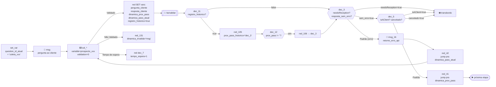

# 🎨 Fluxograma Visual — Venda Megalink (Matrix)

> Diagrama completo do fluxo, do primeiro "oi" até o agendamento da instalação.
> Use junto com [FLUXOGRAMA_APIS.md](FLUXOGRAMA_APIS.md) para os detalhes de cada chamada.

---

## 🌐 Fluxo completo (Mermaid)

```mermaid
flowchart TD
    Start([📱 Cliente envia 1ª mensagem]) --> Init[/"⚙️ INÍCIO<br/>set vars globais:<br/>url_api, webhook_aurora,<br/>tempo_inatividade"/]

    Init --> API14[["🔍 api_14 GET<br/>/api/consultar/leads/<br/>?search=TELEFONE"]]
    API14 --> Dec6{{"dec_6<br/>lead existe?"}}
    Dec6 -- "result_get_leads ≠ ''" --> SetIDLead[/"set id_lead =<br/>{#result_get_leads}"/]
    Dec6 -- "vazio" --> API8[["📝 api_8 POST<br/>/api/leads/registrar/<br/>retorna id"]]
    API8 --> SetIDLead

    SetIDLead --> MsgBoasVindas["💬 msg_60<br/>'Oi! Que bom ter você...<br/>Qual seu nome?'"]
    MsgBoasVindas --> SolNome["⌨️ sol_2<br/>captura nome"]
    SolNome --> ValidaNome{{"/ia/validar<br/>question_id=coleta_nome"}}
    ValidaNome -- válido --> URA8

    URA8["📞 ura_8<br/>'Quer contratar pelo<br/>WhatsApp ou Site?'"]
    URA8 -- "1 - WhatsApp" --> URA14["📞 ura_14<br/>'Casa ou Empresa?'"]
    URA8 -- "2 - Site" --> MsgLink["💬 msg_24<br/>'Acesse:<br/>robovendas.../cadastro/'"]
    MsgLink --> Transb1[/"☎️ Transbordo<br/>ser_1/ser_2"/]

    URA14 -- "1 - Casa" --> URAPlano["📦 ura_plano<br/>'Plano 620MB R$ 99,90'"]
    URA14 -- "2 - Empresa" --> Transb1

    URAPlano -- "1 - Contratar" --> SetPlano1[/"set:<br/>id_plano_rp = 1649<br/>valor = 99.9<br/>titulo = 'Plano 620MB'<br/>dinamica_prox_pass = 'msg_cep'"/]
    URAPlano -- "2 - mais opções" --> URAPlano2["📦 ura_plano_2<br/>1GB Turbo, Energia,<br/>Rastreamento"]

    URAPlano2 -- "Turbo" --> SetPlanoTurbo[/"set plano 1GB Turbo"/]
    SetPlanoTurbo --> MsgCEP

    SetPlano1 --> MsgCEP["💬 msg_cep<br/>'Pra seguir, vou<br/>verificar viabilidade'"]

    MsgCEP --> SolCEP["⌨️ sol_7<br/>'Digite seu CEP'<br/>captura prospecto_cep"]
    SolCEP --> APIConsultaCEP[["🌍 api_consulta_cep<br/>/ia/validar<br/>question_id=coleta_cep"]]

    APIConsultaCEP --> Dec4{{"dec_4<br/>CEP válido?"}}
    Dec4 -- "viabilidade_cep=false" --> Transb1
    Dec4 -- "resposta_correta=false" --> MsgErroCEP["💬 msg_21<br/>{#api_cep}<br/>'CEP inválido'"]
    MsgErroCEP --> SolCEP
    Dec4 -- "Padrão (válido)" --> CamposFalt{{"campos_faltantes<br/>ret_* tudo preenchido?"}}

    CamposFalt -- "ret_cidade=''" --> SolCidadeManual["⌨️ sol_cidade<br/>manual"]
    CamposFalt -- "ret_bairro=''" --> SolBairroManual["⌨️ sol_bairro<br/>manual"]
    CamposFalt -- "ret_rua=''" --> SolRuaManual["⌨️ sol_rua<br/>manual"]
    CamposFalt -- "tudo ok" --> URA7

    SolCidadeManual --> URA7
    SolBairroManual --> URA7
    SolRuaManual --> URA7

    URA7["📞 ura_7<br/>'Confirme endereço:<br/>{ret_cep}, {ret_rua}...<br/>Posso seguir?'"]
    URA7 -- "1 - corretos" --> MsgNumResid
    URA7 -- "2 - corrigir" --> SolCEPManual["⌨️ sol_cep manual<br/>(Grupo CEP)"]
    SolCEPManual --> SolCidadeManual

    MsgNumResid["💬 msg_n_residencia<br/>'Digite o número'"]
    MsgNumResid --> SolNumero["⌨️ sol_13 número<br/>captura n_resisdencia"]
    SolNumero --> ValidaNumero{{"/ia/validar<br/>question_id=coleta_numero"}}
    ValidaNumero -- válido --> MsgPontoRef

    MsgPontoRef["💬 msg_ponto_referencia<br/>'Ponto de referência?'"]
    MsgPontoRef --> SolPontoRef["⌨️ sol_13 ponto_ref"]
    SolPontoRef --> ValidaPonto{{"/ia/validar<br/>question_id=<br/>coleta_ponto_referencia"}}
    ValidaPonto -- válido --> MsgNomeCompleto

    MsgNomeCompleto["💬 msg_Nome_completo<br/>'Seu nome completo?'"]
    MsgNomeCompleto --> SolNomeCompleto["⌨️ sol_13 nome"]
    SolNomeCompleto --> ValidaNomeCompleto{{"/ia/validar<br/>question_id=coleta_nome"}}
    ValidaNomeCompleto -- válido --> MsgCPF

    MsgCPF["💬 msg_sol_cpf<br/>'Pode informar seu CPF?'"]
    MsgCPF --> SolCPF["⌨️ sol_13 CPF<br/>captura prospecto_cpf"]
    SolCPF --> ValidaCPF{{"/ia/validar<br/>question_id=coleta_cpf"}}
    ValidaCPF -- "isAClient=true" --> Transb1
    ValidaCPF -- "cancelado=true" --> Transb1
    ValidaCPF -- válido --> MsgEmail

    MsgEmail["💬 msg_sol_rg<br/>'Seu e-mail?'"]
    MsgEmail --> SolEmail["⌨️ sol_13 email"]
    SolEmail --> ValidaEmail{{"/ia/validar<br/>question_id=coleta_email"}}
    ValidaEmail -- válido --> MsgNascimento

    MsgNascimento["💬 msg_sol_nascimento<br/>'Data de nascimento?'"]
    MsgNascimento --> SolNascimento["⌨️ sol_13 nascimento"]
    SolNascimento --> ValidaNasc{{"/ia/validar<br/>question_id=<br/>coleta_data_nascimento"}}
    ValidaNasc -- válido --> URAVenc

    URAVenc["📞 ura_12<br/>'Dia de vencimento?<br/>1, 5, 15 ou 20'"]
    URAVenc -- escolha --> MsgCobranca["💬 msg_72<br/>'Sobre cobrança...'"]

    MsgCobranca --> APIEmailVenc[["💰 api_email_nas_ven POST<br/>/api/leads/atualizar/<br/>status=aguardando_assinatura"]]
    APIEmailVenc --> URAConfirma

    URAConfirma["📞 ura_13<br/>'Confirme dados:<br/>Plano, CPF, Endereço...<br/>Tudo certo?'"]
    URAConfirma -- "1 - Concluir" --> Docs

    Docs["📸 GRUPO sol_16/17/18<br/>Selfie + Frente + Verso"]
    Docs --> APIFinaliza[["✅ api_finaliza_lead POST<br/>status_api=pendente"]]
    APIFinaliza --> APIHist[["📜 api_fluxo_finalizado<br/>/api/historicos/registrar/"]]
    APIHist --> MsgSucesso["💬 msg_73<br/>'Contratação finalizada!<br/>Bem-vindo à Megalink'"]

    MsgSucesso --> URADataInst["📞 ura_10<br/>'Manhã ou Tarde?'"]
    URADataInst --> API25[["📅 api_25 GET<br/>/consultar_datas_sem_domingo<br/>retorna datas_1/2/3"]]
    API25 --> URAEscolheData["📞 ura_11<br/>'Escolha a data:'"]

    URAEscolheData --> HubsoftPoll[["🔄 GRUPO verifica_status_cliente<br/>Loop api_21 + wait 20s<br/>até is_a_client_hubsoft=true"]]
    HubsoftPoll --> API22[["📋 api_22 GET<br/>/consultar_agenda"]]
    API22 --> API23[["🎫 api_23 POST<br/>/abrir_atendimento"]]
    API23 --> API24[["🛠️ api_24 POST<br/>/abrir_os"]]
    API24 --> MsgAgendada["💬 msg_38<br/>'Instalação agendada<br/>para {data} {turno}'"]
    MsgAgendada --> Fim([🎯 fin_2])

    Transb1 --> FimTransb([🎯 fin_1<br/>com atendente])

    classDef api fill:#2c5282,stroke:#1a365d,color:#fff
    classDef dec fill:#d69e2e,stroke:#975a16,color:#000
    classDef sol fill:#38a169,stroke:#22543d,color:#fff
    classDef msg fill:#e2e8f0,stroke:#4a5568,color:#000
    classDef ura fill:#805ad5,stroke:#44337a,color:#fff
    classDef setvar fill:#fed7aa,stroke:#9c4221,color:#000
    classDef fim fill:#c53030,stroke:#742a2a,color:#fff

    class API14,API8,APIConsultaCEP,APIEmailVenc,APIFinaliza,APIHist,API25,API22,API23,API24,HubsoftPoll api
    class Dec6,Dec4,CamposFalt,ValidaNome,ValidaNumero,ValidaPonto,ValidaNomeCompleto,ValidaCPF,ValidaEmail,ValidaNasc dec
    class SolNome,SolCEP,SolCidadeManual,SolBairroManual,SolRuaManual,SolCEPManual,SolNumero,SolPontoRef,SolNomeCompleto,SolCPF,SolEmail,SolNascimento sol
    class MsgBoasVindas,MsgCEP,MsgErroCEP,MsgNumResid,MsgPontoRef,MsgNomeCompleto,MsgCPF,MsgEmail,MsgNascimento,MsgCobranca,MsgSucesso,MsgAgendada,MsgLink msg
    class URA8,URA14,URAPlano,URAPlano2,URA7,URAVenc,URAConfirma,URADataInst,URAEscolheData ura
    class SetIDLead,SetPlano1,SetPlanoTurbo setvar
    class Fim,FimTransb,Transb1 fim
```



---

## 📦 Detalhe — Padrão "Pergunta → Validar IA"

Esse é o **micro-padrão** que se repete pra cada coleta. Implemente uma vez, replique:



---

## 🔑 Variáveis que você precisa setar ANTES de cada chamada `/ia/validar`

| Var | Valor (exemplo CPF)         | Onde usar                                |
|------------|---------------------------------|------------------------------------------|
| `question_id_atual` | `"coleta_cpf"`         | body da API (lookup direto da regra)     |
| `pergunta_cliente` | `"Pode me informar seu CPF?"`| body da API (`question`)                 |
| `resposta_cliente` | `{#prospecto_cpf}`          | body da API (`answer`)                   |
| `dinamica_prox_pass` | `"msg_22"` (próximo passo)| red_41 (sucesso)                         |
| `dinamica_pass_atual`| `"msg_sol_cpf"`           | red_42 (erro — repete pergunta)          |
| `registro_historico` | `"true"`                  | dec_11 (loga histórico no Django)        |

---

## 🧬 Padrão "CEP" (diferente — vem direto do sol)

```mermaid
flowchart LR
    A[set_var<br/>question_id_atual<br/>= 'coleta_cep'] --> B[💬 msg_33<br/>'Digite seu CEP']
    B --> C[⌨️ sol_7<br/>variable=prospecto_cep]
    C -- "Validado" --> D[[🌍 api_consulta_cep<br/>BODY HARDCODED:<br/>answer={#prospecto_cep}<br/>question_id='coleta_cep']]
    D --> E{{dec_4}}
    E -- "viabilidade_cep=false" --> T[☎️ transbordo]
    E -- "resposta_correta=false" --> M21[💬 msg_21<br/>{api_cep}]
    M21 --> C
    E -- "Padrão" --> F{{campos_faltantes}}
    F -- "ret_cidade=''" --> SolCM[⌨️ sol_cidade manual] --> URA7
    F -- "ret_bairro=''" --> SolBM[⌨️ sol_bairro manual] --> URA7
    F -- "ret_rua=''" --> SolRM[⌨️ sol_rua manual] --> URA7
    F -- "tudo preenchido" --> URA7
    URA7[📞 ura_7<br/>confirma endereço]
    URA7 -- corretos --> NEXT([▶️ msg_n_residencia])
```

> ⚠️ **Importante:** o `api_consulta_cep` usa `answer={#prospecto_cep}` direto (não `{#resposta_cliente}`), porque o flow não passa por um red intermediário entre o sol_7 e a API.

---

## 🚦 Estados do `status_api` no Lead Django

```
processamento_manual  ← criado por api_8
       ↓
aguardando_assinatura ← api_email_nas_ven (após URA confirmação)
       ↓
pendente              ← api_finaliza_lead (após docs)
       ↓
[ Cliente assina contrato externamente → vira Hubsoft ]
       ↓
[ Flow continua: api_21 polling, depois agendamento ]
```

---

## 📌 Checklist pra implementar no Matrix

### Antes de começar

- [ ] Criar variáveis Matrix (todas listadas em [FLUXOGRAMA_APIS.md](FLUXOGRAMA_APIS.md))
- [ ] Cadastrar **22 regras** no Django Admin em `/admin/ia_validador/regravalidacao/` (a migration `0002_seed_regras_megalink` já populou)
- [ ] Confirmar que a IA está respondendo: `curl https://robovendas.megalinkpiaui.com.br/ia/` deve retornar `{"status":"ok",...}`

### Estrutura mínima

- [ ] **Grupo INICIO**: api_14 + dec_6 + api_8 + msg boas-vindas
- [ ] **Grupo Venda Automática**: sequência de sols + chamadas /ia/validar
- [ ] **Grupo Validador IA** (genérico): api_valida_resposta + dec_3 + dec_5 + red_41/42 (essa estrutura serve TODAS as perguntas)
- [ ] **Grupo CEP**: sol_7 + api_consulta_cep + dec_4 + campos_faltantes + ura_7
- [ ] **Grupos Manuais**: Rua, Bairro, Cidade, CEP (caso ViaCEP não retorne tudo)
- [ ] **Grupo Documentos**: sol_16/17/18 + 3 chamadas /ia/validar
- [ ] **Grupo Finalização**: api_email_nas_ven, api_finaliza_lead, api_fluxo_finalizado
- [ ] **Grupo Hubsoft** (opcional): polling api_21 + api_22/23/24/25
- [ ] **Grupo Transbordo**: hor_1 + ser_1/ser_2

### Variáveis-chave que precisam ser ÚNICAS no flow

| Identifier alvo de redirect | Onde aparece                          |
|---------------------------------|---------------------------------------|
| `msg_22`, `msg_29`, `msg_30`    | dinamica_prox_pass                    |
| `msg_sol_cpf`, `msg_sol_rg` etc | dinamica_pass_atual                   |
| `msg_cep`, `msg_n_residencia`   | dinamica_prox_pass                    |
| `ura_7`, `ura_8`, `ura_plano`   | dinamica_prox_pass                    |
| `campos_faltantes`              | dinamica_prox_pass (depois de CEP)    |
| `dec_3`                         | prox_pass_historico                   |

> ⚠️ Se algum desses estiver duplicado, o `red type=2` vai pular pra um aleatório.

---

## 🎯 Resumo: 4 tipos de blocos lógicos

```
┌──────────────────────────────────────────────────────────────┐
│ 1. CADASTRO (apenas no início)                               │
│    api_14 → dec_6 → api_8 → set id_lead                      │
└──────────────────────────────────────────────────────────────┘

┌──────────────────────────────────────────────────────────────┐
│ 2. COLETA + VALIDAÇÃO (repete N vezes)                       │
│    set_var question_id → msg → sol → red(set vars)           │
│    → /ia/validar → dec_3 → dec_5 → red_41 → próximo passo    │
└──────────────────────────────────────────────────────────────┘

┌──────────────────────────────────────────────────────────────┐
│ 3. URAs (escolhas pelo cliente, sem IA)                      │
│    ura → opção → set_var → próximo passo                     │
└──────────────────────────────────────────────────────────────┘

┌──────────────────────────────────────────────────────────────┐
│ 4. FINALIZAÇÃO (3 APIs em sequência)                         │
│    api_email_nas_ven → api_finaliza_lead → api_historico     │
│    → (opcional) Hubsoft polling + agendamento                │
└──────────────────────────────────────────────────────────────┘
```
