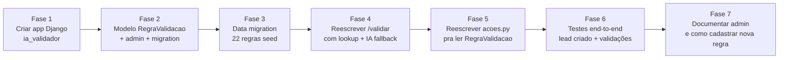

# 🎯 Validador V2 — Design Proposto

> Status: **rascunho para validação**. Aguardando seu OK antes de implementar.

---

## 1. Filosofia

| | Modelo atual `/conversar` | **Modelo proposto `/validar`** |
|---|---|---|
| Quem controla o fluxo | API IA | **Matrix** (você desenha no editor) |
| Quem valida + extrai dados | API IA | API IA |
| Quem dispara ações Django | API IA | API IA |
| Configuração de regras | YAML no servidor | **Django admin** (você edita pela web) |
| Como API conhece a pergunta | Lê etapa do contexto | **Recebe `question_id` (opcional) ou infere por IA** |

**A IA volta a ser um VALIDADOR PURO + EXECUTOR DE AÇÕES.**

---

## 2. Contrato da API

### Request

```http
POST https://robovendas.megalinkpiaui.com.br/ia/validar
Content-Type: application/json
```

```json
{
  "question": "Pode me informar seu CPF?",
  "answer": "529.982.247-25",
  "cellphone": "5586999999999",
  "lead_id": 1975,
  "question_id": "coleta_cpf"
}
```

| Campo | Obrigatório | Descrição |
|-------|-------------|-----------|
| `question` | ✅ | Texto literal da pergunta feita pelo Matrix |
| `answer` | ✅ | Resposta do cliente (texto OU URL de imagem) |
| `cellphone` | ✅ | Telefone do contato (chave de contexto) |
| `lead_id` | ❌ | ID do lead no Django (se já criado). Se não vier, API busca por telefone |
| `question_id` | ❌ | Identificador da regra a aplicar (ex: `coleta_cpf`). Se vier, **lookup direto na tabela** sem usar IA pra inferir |

### Response

```json
{
  "valido": true,
  "extracted_data": {
    "cpf_cnpj": "52998224725"
  },
  "message": "Show, peguei seu CPF! ##2705##",
  "intent": "ok",
  "transbordo": false,
  "fim_fluxo": false,
  "actions_executed": [
    {"tipo": "atualizar_lead", "ok": true, "detalhes": "campo cpf_cnpj atualizado"},
    {"tipo": "adicionar_tag", "ok": true, "detalhes": "tag Comercial adicionada"}
  ],
  "regra_aplicada": "coleta_cpf",
  "tentativas": 0,
  "usou_ia": false,
  "confianca": 1.0
}
```

| Campo | Tipo | Significado |
|-------|------|-------------|
| `valido` | bool | Resposta atende ao esperado pela pergunta |
| `extracted_data` | dict | Campos do lead extraídos (chaves = nomes de coluna do model) |
| `message` | string | Mensagem pro Matrix exibir ao cliente |
| `intent` | string | `ok`, `suporte`, `cancelar`, `desistir`, `duvida`, `sem_viabilidade` |
| `transbordo` | bool | Sinaliza pro Matrix encaminhar pra atendente |
| `fim_fluxo` | bool | Sinaliza pro Matrix encerrar (raro — geralmente o Matrix decide) |
| `actions_executed` | list | Log do que a API fez (auditoria) |
| `regra_aplicada` | string | Nome da `RegraValidacao` que foi usada |
| `tentativas` | int | Tentativas falhas nesta pergunta |
| `usou_ia` | bool | Se OpenAI foi chamado |
| `confianca` | float | 0.0-1.0 |

### Fluxo de identificação

```
┌─── question_id presente? ───┐
│ Sim                          │ Não
▼                              ▼
Lookup direto              IA infere
RegraValidacao             pela pergunta
(rápido, barato)           (mais flexível)
        │                          │
        └────────┬─────────────────┘
                 ▼
         Aplica extractor
         (cpf, cep, nome, ...)
                 │
                 ▼
         Extractor resolveu?
         Sim → válido          Não → chama IA (gpt-4o-mini)
                 │                       │
                 └───────────┬───────────┘
                             ▼
                     Executa ações da regra
                     em background:
                     - atualizar_lead
                     - status_api
                     - tags
                     - historico
                             │
                             ▼
                       Retorna JSON
```

---

## 3. Modelo Django: `RegraValidacao`

Localização proposta: **novo app `ia_validador`** dentro de `dashboard_comercial/gerenciador_vendas/` (separado pra não poluir `vendas_web` ou `crm`).

```python
class RegraValidacao(models.Model):
    """Configuração por pergunta — gerenciada pelo Django admin."""

    # ── Identificação ─────────────────────────────────────────────
    question_id = models.SlugField(
        max_length=80, unique=True,
        help_text='Identificador único enviado pelo Matrix (ex: coleta_cpf)',
    )
    pergunta_padrao = models.TextField(
        help_text='Texto da pergunta no Matrix (referência + matching textual)',
    )
    ordem = models.IntegerField(
        default=0,
        help_text='Ordem sugerida no fluxo (informativo)',
    )
    descricao = models.CharField(max_length=200, blank=True)
    ativo = models.BooleanField(default=True)

    # ── Validação ─────────────────────────────────────────────────
    EXTRACTOR_CHOICES = [
        ('cpf', 'CPF'),
        ('cep', 'CEP (com ViaCEP)'),
        ('nome', 'Nome completo'),
        ('telefone', 'Telefone'),
        ('data_nascimento', 'Data nascimento (>=18 anos)'),
        ('email', 'E-mail'),
        ('numero', 'Número (residência)'),
        ('opcao', 'Opção de menu (1, 2, 3...)'),
        ('confirmacao', 'Sim/Não'),
        ('imagem', 'URL de imagem'),
        ('texto_livre', 'Texto livre (IA decide)'),
        ('livre', 'Sem validação (sempre aceita)'),
    ]
    extractor_tipo = models.CharField(max_length=20, choices=EXTRACTOR_CHOICES, default='texto_livre')
    extractor_config = models.JSONField(
        default=dict, blank=True,
        help_text='Config extra: opcoes válidas, regex custom, etc',
    )
    instrucoes_ia = models.TextField(
        blank=True,
        help_text='Texto extra adicionado ao prompt da IA (se cair em fallback)',
    )
    permite_pular = models.BooleanField(default=False)
    max_tentativas = models.IntegerField(default=3)

    # ── Ações ao validar com sucesso ──────────────────────────────
    # Atualizar campo do lead
    campo_lead_atualizar = models.CharField(
        max_length=60, blank=True,
        help_text='Nome do campo no LeadProspecto (ex: cpf_cnpj). Recebe extracted_data.',
    )
    # Status
    status_api_apos_sucesso = models.CharField(
        max_length=40, blank=True,
        help_text='Ex: aguardando_assinatura, em_instalacao, pendente',
    )
    # Tags
    tags_adicionar = models.JSONField(
        default=list, blank=True,
        help_text='Lista de strings: ["Comercial", "Endereço"]',
    )
    tags_remover = models.JSONField(default=list, blank=True)
    # Histórico
    historico_status_apos_sucesso = models.CharField(
        max_length=40, blank=True,
        help_text='Ex: fluxo_inicializado, fluxo_finalizado, resposta',
    )
    historico_observacoes_template = models.TextField(
        blank=True,
        help_text='Template para observacao do histórico (vars: {question}, {answer})',
    )
    # Imagem (quando answer é URL)
    descricao_imagem = models.CharField(
        max_length=50, blank=True,
        help_text='Se extractor=imagem, descrição a salvar (ex: selfie_com_doc)',
    )

    # ── Ações em caso de falha (max tentativas) ───────────────────
    forcar_transbordo_apos_max = models.BooleanField(default=False)

    # ── Mensagens ─────────────────────────────────────────────────
    msg_sucesso = models.TextField(blank=True, help_text='Padrão: "Show, anotei!"')
    msg_erro = models.TextField(blank=True, help_text='Ex: "CPF inválido, confere?"')
    msg_max_tentativas = models.TextField(blank=True)

    # ── Auditoria ─────────────────────────────────────────────────
    data_criacao = models.DateTimeField(auto_now_add=True)
    data_atualizacao = models.DateTimeField(auto_now=True)

    class Meta:
        app_label = 'ia_validador'
        ordering = ['ordem', 'question_id']

    def __str__(self):
        return f'{self.question_id} ({self.get_extractor_tipo_display()})'
```

### Admin Django

Tela do admin terá:
- Lista de regras com filtros (extractor_tipo, ativo)
- Inline edit do JSON `extractor_config`
- Botão "Testar regra" que dispara um `validar` mock e mostra resultado

---

## 4. Seed inicial — regras do fluxo de vendas Megalink

Vão ser criadas via data migration. Lista completa:

| question_id | extractor | campo_lead | status | tags | descrição |
|-------------|-----------|------------|--------|------|-----------|
| `cumprimento` | texto_livre | — | — | — | Detectar intent (contratar/suporte/cancelar) |
| `tipo_imovel` | opcao | — | — | — | casa/empresa (opções) |
| `coleta_cidade` | nome | cidade | — | — | Texto livre, valida cobertura |
| `coleta_cep` | cep | cep, rua, bairro, cidade, estado | — | `[Endereço]` | Extractor com ViaCEP |
| `coleta_rua` | texto_livre | rua | — | — | Fallback se CEP falhou |
| `coleta_bairro` | texto_livre | bairro | — | — | Fallback |
| `coleta_numero` | numero | numero_residencia | — | — | Aceita S/N |
| `coleta_ponto_referencia` | texto_livre | ponto_referencia | — | — | Permite pular |
| `coleta_nome` | nome | nome_razaosocial | — | `[Comercial]` | Nome completo |
| `coleta_cpf` | cpf | cpf_cnpj | — | — | Valida dígito |
| `coleta_rg` | texto_livre | rg | — | — | Permite "não tem" |
| `coleta_data_nascimento` | data_nascimento | data_nascimento | — | — | Valida >=18 |
| `coleta_email` | email | email | — | — | Permite pular |
| `escolha_plano` | opcao | id_plano_rp | — | — | 300/620/1G/2G (extractor_config tem mapeamento) |
| `dia_vencimento` | opcao | id_dia_vencimento | — | — | 5/10/15/20/25 |
| `confirmacao_dados` | confirmacao | — | `aguardando_assinatura` | `[Assinado]` | Sim/Não |
| `documentacao_selfie` | imagem | — | — | — | descricao_imagem=`selfie_com_doc` |
| `documentacao_frente` | imagem | — | — | `[Documental]` | descricao_imagem=`frente_doc` |
| `documentacao_verso` | imagem | — | — | — | descricao_imagem=`verso_doc` |
| `escolha_turno` | opcao | — | — | — | manhã/tarde |
| `escolha_data` | opcao | — | — | — | data 1/2/3 |
| `confirmacao_agendamento` | confirmacao | — | `pendente` | — | Encerra fluxo |

**Total: 22 regras.** Você pode editar cada uma pelo admin.

---

## 5. Diagrama final

```mermaid
flowchart TD
    M["📱 Matrix<br/>sol_qualquer →<br/>api_validar"]
    M -->|"POST /ia/validar<br/>{question, answer,<br/>cellphone, lead_id,<br/>question_id?}"| API

    API["🤖 API IA<br/>(/validar)"]

    API --> Lookup{question_id<br/>fornecido?}
    Lookup -->|Sim| RegraLookup[Lookup direto<br/>RegraValidacao<br/>WHERE question_id=...]
    Lookup -->|Não| IAInfer[gpt-4o-mini infere<br/>regra pelo texto da pergunta<br/>+ cacheia 1h]
    RegraLookup --> Regra
    IAInfer --> Regra

    Regra[Regra encontrada<br/>+ extractor_tipo<br/>+ ações configuradas]
    Regra --> TipoExt{Tipo<br/>extractor}

    TipoExt -->|cpf/cep/nome/<br/>data/email/etc| Local[Extractor local<br/>regex + parse]
    TipoExt -->|imagem| Img[answer é URL?<br/>registra imagem]
    TipoExt -->|opcao| Opt[match contra<br/>extractor_config.opcoes]
    TipoExt -->|confirmacao| Conf[sim/não<br/>via IA leve]
    TipoExt -->|texto_livre| Free[chama IA<br/>gpt-4o-mini]

    Local -->|sucesso| Valid
    Local -->|falha| IAFallback[Fallback IA]
    IAFallback --> Valid
    Img --> Valid
    Opt --> Valid
    Conf --> Valid
    Free --> Valid

    Valid[✅ valido=true<br/>extracted_data populado]
    Valid --> Acoes[Background:<br/>executar ações da regra]

    Acoes --> A1["💾 atualizar_lead<br/>POST /api/leads/atualizar/"]
    Acoes --> A2["📊 atualizar status<br/>POST /api/leads/status/"]
    Acoes --> A3["🏷️ tags<br/>POST /api/leads/tags/"]
    Acoes --> A4["📜 historico<br/>POST /api/historicos/registrar/"]
    Acoes --> A5["📸 imagem<br/>POST /api/leads/imagens/registrar/"]

    Acoes --> Resp["📤 Response:<br/>{valido, extracted_data,<br/>message, actions_executed,<br/>intent, transbordo, fim_fluxo}"]
    Resp --> M2[📱 Matrix usa<br/>{message} pra exibir<br/>{intent}/{transbordo} pra rotear]

    style M fill:#E0FFFF
    style API fill:#ADD8E6
    style Regra fill:#FFE4B5
    style Valid fill:#90EE90
    style Acoes fill:#DDA0DD
```

---

## 6. Como o Matrix passaria a usar

No flow.json antigo, **só troque a URL e payload** dos 2 nós que chamavam `webhook_aurora`:

**Antes (`api_valida_resposta`):**
```json
{
  "url": "{#webhook_aurora}",
  "body": {
    "question": "{#pergunta_cliente}",
    "answer": "{#resposta_cliente}",
    "cellphone": "{#CONTATO.TELEFONE}"
  }
}
```

**Depois:**
```json
{
  "url": "https://robovendas.megalinkpiaui.com.br/ia/validar",
  "body": {
    "question": "{#pergunta_cliente}",
    "answer": "{#resposta_cliente}",
    "cellphone": "{#CONTATO.TELEFONE}",
    "lead_id": {#id_lead},
    "question_id": "{#question_id_atual}"
  }
}
```

E adiciona uma variável `question_id_atual` que você seta em cada `sol_*` com o id da regra (ex: antes do sol de CPF, faz `set question_id_atual = "coleta_cpf"`).

**As 28 outras chamadas a `/api/leads/atualizar/`, `/api/historicos/registrar/`, etc no flow.json antigo podem ser REMOVIDAS** — a API IA agora dispara automaticamente.

---

## 7. Plano de implementação (se você aprovar este design)



**Tempo estimado:** 3-4h.

---

## 8. O que mantemos vs descartamos

| Manter | Descartar |
|--------|-----------|
| Extractors locais (cpf, cep, nome, etc) | ❌ `vendas_megalink.yaml` (vira tabela no DB) |
| Cliente Django `robovendas.py` | ❌ `/conversar` endpoint (deprecated) |
| Persona Aurora em prompts.py | ❌ `flow_dinamico.json` (volta ao modelo flow ↔ validador) |
| Contexto da conversa (1h TTL) | ❌ Lógica de `etapa_atual` no validador (Matrix controla) |
| systemd + nginx | ❌ Resolução por etapa do YAML |
| Cliente OpenAI | |

`/conversar` fica como **deprecated mas funcional** durante a transição — depois removemos.

---

## 9. ✅ Decisões finais (confirmadas)

| # | Decisão | Valor |
|---|---------|-------|
| 1 | Identificação da pergunta | `question_id` opcional + IA fallback |
| 2 | Schema de response | Novo (não compatível N8N) |
| 3 | Ações automáticas | atualizar_lead + status + tags + historico |
| 4 | Onde fica `RegraValidacao` | Novo app Django `ia_validador` |
| 5 | Comunicação API IA ↔ Django | HTTP (mantém projeto separado) |
| 6 | Cache de mapeamento pergunta→regra | Ligado, TTL 1h, env var `USAR_CACHE` pra desligar |

---

## 10. 📋 Plano de implementação (estimativa 3-4h)

### Fase 1 — Backend Django (1h)
1. Criar app `ia_validador` em `dashboard_comercial/gerenciador_vendas/`
2. Adicionar ao `INSTALLED_APPS`
3. Criar modelo `RegraValidacao` (campos do design)
4. `admin.py` com ListFilter, search, fieldsets organizados
5. Migration inicial
6. Data migration com seed das 22 regras do fluxo Megalink

### Fase 2 — API IA (`/validar` reescrito) (1.5h)
1. Novo endpoint `POST /validar` com schema do design
2. Cliente HTTP novo: `regra_client.py` que consulta `/api/regras-validacao/` no Django (criar endpoint readonly)
3. Lógica:
   - Lookup por question_id → cache → IA fallback
   - Aplica extractor (cpf/cep/nome/imagem/opcao/...)
   - Executa ações em background via `robovendas.py` (já existe)
4. Cache em memória (`functools.lru_cache` ou dict TTL)
5. Endpoint admin: `POST /admin/invalidar-cache/` (chamado pelo signal Django ao editar regra)

### Fase 3 — Migração do flow.json (30min)
1. Script `tools/migrar_flow_para_v2.py`:
   - Substitui URL de `api_valida_resposta` e `api_consulta_cep` por `/ia/validar`
   - Adiciona `lead_id` e `question_id` no body
   - Remove APIs duplicadas que agora a IA faz (api_9, api_10, api_11, etc) — opcional
2. Gera `flow_megalink_v3.json`

### Fase 4 — Testes (30min)
1. Curl direto pra cada extractor (cpf, cep, opcao, imagem)
2. Validar que ações Django foram disparadas (consultar lead)
3. Validar cache (mesma pergunta → não chama OpenAI 2ª vez)

### Fase 5 — Docs + commit (30min)
1. Atualizar README com novos endpoints
2. Documentar como cadastrar regra nova no admin
3. Commit + push

---

## 11. 🔄 Estado dos endpoints após v2

| Endpoint | Status | Uso |
|----------|--------|-----|
| `POST /validar` | **Reescrito** | Endpoint principal — validação por pergunta |
| `POST /validar/matrix` | Deprecated mas funcional | Compatibilidade N8N antigo |
| `POST /conversar` | Deprecated mas funcional | Modelo dinâmico anterior |
| `GET /contexto/{telefone}` | Mantido | Debug |
| `GET /fluxos` | Removido | YAML não é mais a fonte de verdade |
| `GET /regras` | **Novo** | Lista regras ativas (do DB) |
